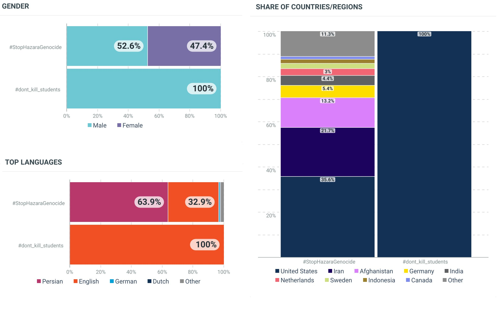

---
lang: ar
dir: rtl
title: "تحلیل معلومات تویتر در رابطه با هشتگ #HazaraGenocide"
author: "علی رضا حسینی٬ گزارشگر سلیم سلطانی"
date: "*Oct 6, 2022*"
output: 
  html_document:
    highlight: tango
    theme: flatly
    toc: yes
    toc_depth: 2
    toc_float: 
      collapsed: no
      smooth_scroll: no
editor_options: 
  chunk_output_type: console
#bibliography: references.bib
link-citations: yes
nocite: '@*'
---


# معرفی


با هشتگ #StopHazaraGenocide بیشتر از ۱.۲ میلیون بار در ۲۴ ساعت گذشته تویت زده شد و به این ترتیب از شروع این طوفان تویتری تا هنوز بیشتر از چهار میلیون و صد هزار تویت با این هشتگ زده شده است. 
منبع: Talkwalker.

```{r,echo=F}
magick::image_draw(magick::image_read("2.png"))
```

```{r,echo=F,results=F}
dev.off()
```


# رشتو!
هشتگ #StopHazaraGenocide چه بلایی بر سر دستگاه تبلیغاتی طالبان آورده است؟
۱- طالبان تلاش کردند تا با راه اندازی دو هشتگ متعلم را نکشید و ما متحدیم به زبان فارسی و انگلیسی مانع ترند شدن هشتگ پایان نسل کشی هزاره ها شوند. اما این ترفند شان به جایی نرسید.
۲- تعداد تویت هایی که توسط طرفداران طالبان زده شده است، اصلا قابل مقایسه با تعداد تویت هایی که با هشتگ #StopHazaraGeoncide نیست. در گراف اول، شما می‌توانید ببینید که در یک هفته‌ی گذشته بیشتر از ۳.۶ میلیون تویت شده است در حالی که با یکی از هشتگ های اصلی طالبان ۱۰۰ تویت شده است.


حتی در این هفته واژه‌ی طالبان که معمولا مثل واژه‌های افغانستان، کابل و یا کریکت در فضای تویتری افغانستان ترند هستند، فرصت ترند شدن را نداشت. دراین دو گراف شما می‌توانید تفاوت بزرگی که میان تعداد تویت ها و سطح تعامل(ٍEngagement) با این تویت ها وجود دارد را ببینید.


۴- گستردگی #StopHazaraGenocide تنها فرصت خبری در تویتر را از طالبان نگرفته بلکه باعث شده تا در رسانه های‌ خبری نیز واژه‌ی طالبان تنها در پست های نسبتا غیرمرتبط دیده شود. این لیست شامل پرببیننده‌ترین مطالب خبریست که واژه طالبان درآن دیده شده ولی ربط مستقیمی به فعالیت طالبان ندارد.


۵- نکات جالب دیگر اینکه هشتگی که طالبان برای انحراف #StopHazaraGenocide راه انداختن تنها توسط کاربران مرد و به زبان انگلیسی تویت شده. همچنین تمام این تویت ها نه از افغانستان بلکه از آمریکا تویت شده است. جزئیات بیشتر را در این گراف ها ببینید.


